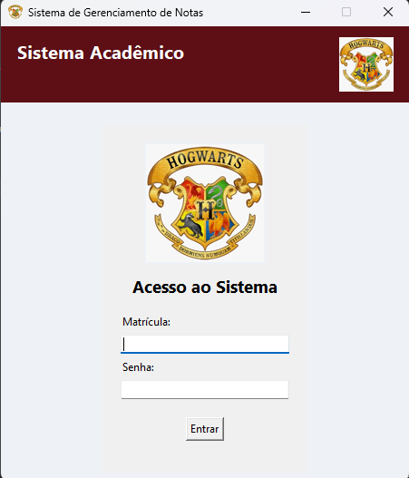

# Sistema de Gerenciamento Acadêmico - Python-X-BD

<!-- Sugestão: Tire um print da tela de login e adicione aqui -->


Um sistema de desktop para gerenciamento de notas e informações acadêmicas, desenvolvido em Python com uma interface gráfica construída em Tkinter. O projeto simula um ambiente acadêmico com diferentes perfis de usuário (Aluno, Professor e Secretaria), cada um com seu próprio painel e funcionalidades específicas.

## 🎯 Objetivo

O principal objetivo deste projeto é criar uma aplicação CRUD (Create, Read, Update, Delete) funcional que demonstre a integração entre uma interface de usuário em Python (Tkinter) e um banco de dados relacional. Ele serve como um estudo de caso prático para desenvolvimento de software desktop, gerenciamento de estado e controle de acesso baseado em papéis.

## ✨ Funcionalidades Principais

*   **Autenticação Segura:** Tela de login com validação de matrícula e senha. As senhas são armazenadas de forma segura no banco de dados usando hash `bcrypt`.
*   **Controle de Acesso Baseado em Papel:** A aplicação direciona o usuário para uma tela específica dependendo do seu tipo de perfil:
    *   **Painel do Aluno:** Permite a visualização de notas e informações pessoais.
    *   **Painel do Professor:** Oferece ferramentas para lançar e editar notas de alunos em suas disciplinas.
    *   **Painel da Secretaria:** Funcionalidades administrativas para gerenciar cadastros de alunos, professores e disciplinas.
*   **Interface Gráfica Intuitiva:** Interface amigável e temática, construída com a biblioteca padrão do Python, Tkinter.
*   **Gerenciamento de Dados:** Interação completa com um banco de dados para persistir todas as informações do sistema.

## 🛠️ Tecnologias Utilizadas

*   **Linguagem:** Python 3
*   **Interface Gráfica:** Tkinter
*   **Banco de Dados:** SQLite (gerenciado via `database_manager.py`)
*   **Segurança:** `bcrypt` para hashing de senhas
*   **Imagens:** `Pillow` (PIL) para manipulação de imagens na interface.

## 🚀 Como Executar o Projeto

1.  **Clone o repositório:**
    ```bash
    git clone https://github.com/seu-usuario/Python-X-BD.git
    cd Python-X-BD
    ```

2.  **Instale as dependências:**
    ```bash
    pip install -r requirements.txt
    ```

3.  **Execute a aplicação:**
    O ponto de entrada do sistema é o script de login.
    ```bash
    python login.py
    ```
